# LibreSDR B220 Mini — FPGA Firmware Technical Reference

<p align="center">
  <strong>F4TNK Optimized Firmware — Production Release V15</strong><br/>
  <em>Station SatNOGS #3762 · April 2026</em>
</p>

---

## Table of Contents

- [1. What is an FPGA?](#1-what-is-an-fpga)
- [2. What does this Firmware do?](#2-what-does-this-firmware-do)
- [3. System Architecture](#3-system-architecture)
- [4. Hardware Platform](#4-hardware-platform)
- [5. V13 DSP Architecture — RX Path (DDC)](#5-v13-dsp-architecture--rx-path-ddc)
- [6. V13 DSP Architecture — TX Path (DUC)](#6-v13-dsp-architecture--tx-path-duc)
- [7. V13 Key Changes — Engineering Detail](#7-v13-key-changes--engineering-detail)
- [8. Version History](#8-version-history)
- [9. Absolute Design Rules](#9-absolute-design-rules)
- [10. RTL Audit Results — V13](#10-rtl-audit-results--v13)
- [11. FPGA Resource Utilization](#11-fpga-resource-utilization)
- [12. Build & Deployment](#12-build--deployment)

---

## 1. What is an FPGA?

### 1.1 Conceptual Overview

A **Field-Programmable Gate Array (FPGA)** is a semiconductor device containing a large matrix of configurable logic blocks (CLBs) interconnected by a programmable routing fabric. Unlike a CPU, which executes instructions sequentially, an FPGA implements logic **spatially**: computations run in parallel, mapped directly onto silicon gates.

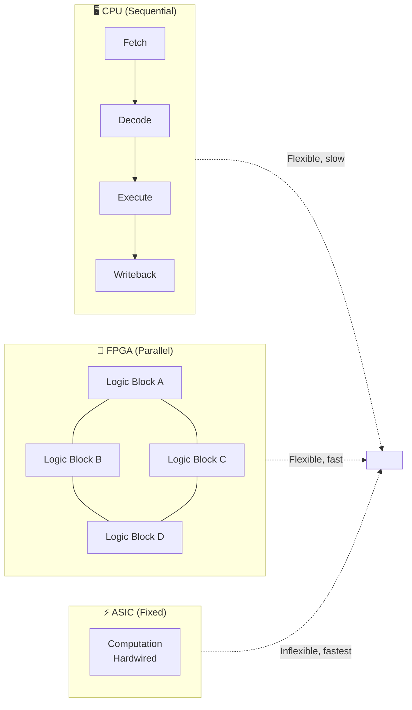

| Property | CPU | FPGA | ASIC |
|:---|:---:|:---:|:---:|
| Reconfigurable | ✅ | ✅ | ❌ |
| Parallel execution | ❌ | ✅ | ✅ |
| Deterministic timing | ❌ | ✅ | ✅ |
| Development cost | Low | Medium | Very High |
| Throughput @ 100 MHz | ~100 MOPS | **~100 GOPS** | ~1 TOPS |

### 1.2 FPGA Internal Structure

The Xilinx **Artix-7 XC7A200T** used on the LibreSDR B220 Mini contains:

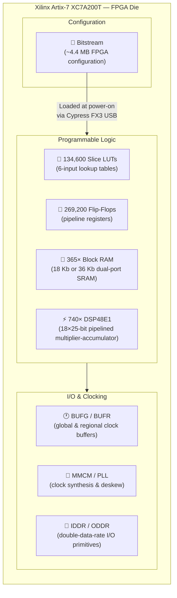

**How the FPGA is configured:** At power-on, the host PC sends a **bitstream** file (`.bin`, ~4.4 MB) over USB 3.0. This bitstream programs every LUT, every routing switch, every DSP connection — defining the entire digital circuit. Changing the bitstream changes the circuit. This is what firmware versions do.

### 1.3 The DSP48E1 — Core of the Datapath

Every arithmetic operation in the signal chain uses the **DSP48E1** primitive — a hard-wired 18×25-bit two's complement multiplier followed by a 48-bit accumulator with pre-adder, all pipelined at up to 450 MHz.

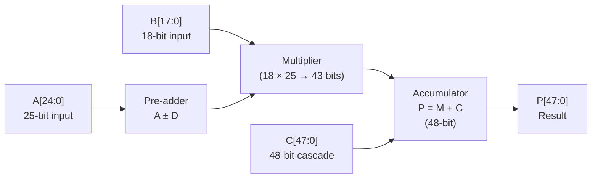

In this firmware, DSP48E1 blocks implement:
- **CIC integrators/differentiators** (accumulators)
- **IQ balance matrix** (complex multiplications)
- **Halfband FIR filters** (symmetric convolutions)
- **CIC droop compensator** (FIR 5-tap)
- **Prescale / output scaling** (coefficient multiplication)

---

## 2. What does this Firmware do?

### 2.1 Role in the SDR System

The FPGA firmware is the **digital signal processing engine** that sits between the RF transceiver (AD9361) and the host computer. It performs real-time signal processing at rates far exceeding what any general-purpose CPU could handle.

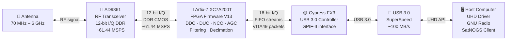

**Without the FPGA**, the host would receive raw ADC samples at 61.44 MSPS × 24 bits = **~1.47 Gbps** — far exceeding USB 3.0 bandwidth. The FPGA performs:

| Function | From | To | Reduction |
|:---|:---:|:---:|:---:|
| **Decimation (DDC)** | 61.44 MSPS | 30 kSPS | ×2048 |
| **Bit width reduction** | 24-bit internal | 16-bit USB | 33% |
| **Effective data rate** | 1,474 Mbps raw | **~1 Mbps** to USB | **1000×** |

### 2.2 The Firmware V15 Specifically

Version 15 is the **current production release**, incorporating 15 generations of iterative DSP refinement and USB transport fixes targeting **weak-signal LEO satellite reception** on the SatNOGS #3762 station. V15 fixes a critical GPIF padding bug introduced in V14 that caused CTRL channel packet desynchronization on USB 2.0.

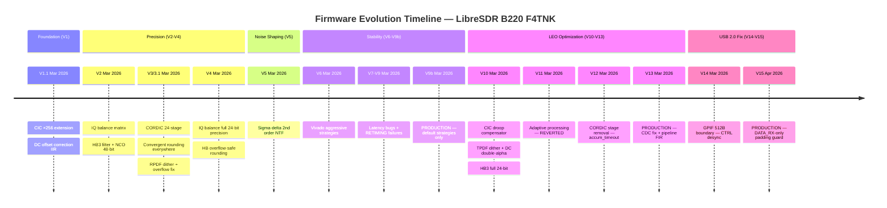

---

## 3. System Architecture

### 3.1 Full Signal Path Overview

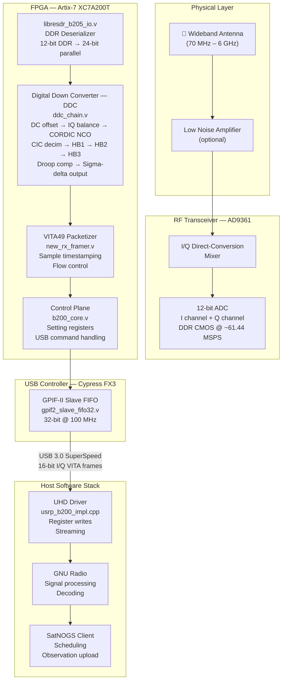

### 3.2 Clock Domains

The design operates across three clock domains, requiring careful Clock Domain Crossing (CDC) synchronization:

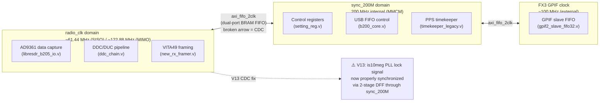

---

## 4. Hardware Platform

| Component | Part Number | Role | Notes |
|:---|:---|:---|:---|
| **FPGA** | Xilinx Artix-7 **XC7A200T-FBG484-2** | Digital signal processing, control, USB bridge | 7-Series, DSP48E1, 200T = 200K LUT equivalent |
| **RF Transceiver** | Analog Devices **AD9361** | RF ↔ baseband conversion, 70 MHz–6 GHz | 12-bit I/Q, DDR CMOS, direct conversion |
| **USB Controller** | Cypress **FX3 (CYUSB3014)** | USB 3.0 SuperSpeed device interface | GPIF-II protocol, 32-bit @ 100 MHz |
| **RF Clock** | ~61.44 MHz (PLL output from AD9361) | Base clock for all DSP stages | Derived from 40 MHz TCXO or external 10 MHz |
| **Reference** | Leo Bodnar Mini GPSDO (station option) | 10 MHz GPS-disciplined reference | `clock_source=external`, PPB-level accuracy |

> **Note on naming:** Despite the "B220" name, this board uses an Artix **200T** (not a Spartan-6 as on the original Ettus USRP B210). The design uses full Artix-7 Series primitives: `DSP48E1`, `RAMB36E1`, `BUFGMUX`, `MMCME2_ADV`, `IDDR`/`ODDR`.

---

## 5. V13 DSP Architecture — RX Path (DDC)

### 5.1 Complete RX Signal Chain

The Digital Down Converter (DDC) transforms the ADC output (12-bit, 61.44 MSPS) into complex baseband samples (16-bit I/Q) at a decimated rate suitable for USB transfer and software demodulation.

```mermaid
flowchart TB
    ADC["🔴 AD9361 ADC Output\n12-bit I and Q\nDDR CMOS interface\n~61.44 MSPS"]

    DESER["📦 DDR Deserializer\nlibresdr_b205_io.v\n12-bit DDR → 24-bit parallel\nIDDR primitives + BUFR"]
    ADC -->|"12-bit I, 12-bit Q\nDouble Data Rate"| DESER

    MUX["🔀 Input MUX\nddc_chain.v\nMode: IQ / Real / Swap\n24-bit"]
    DESER --> MUX

    DC["🔇 DC Offset Corrector\ndc_offset_correct.v  V1.1 + V12\nIIR highpass: fc ≈ 9 Hz\nALPHA_FAST=14 → ALPHA=20\n44-bit accumulator\nbypass: SR BASE+5"]
    MUX --> DC

    IQB["⚖️ IQ Balance Matrix\niq_balance.v  V2 + V4\nI_out = alpha × I_in\nQ_out = beta × I_in + Q_in\nalpha: SR BASE+6   beta: SR BASE+7\nDSP48E1 × 2  24×18-bit full precision"]
    DC --> IQB

    DITHER["🎲 TPDF Dither\nddc_chain.v  V10\nDual-LFSR 16-bit\nseeds ACE1h / 7B3Fh\nTriangular ±2 LSB\nEliminates CIC idle tones"]
    IQB --> DITHER

    CORDIC["🎯 CORDIC NCO\ncordic_z24.v  V3\n24 pipeline stages\n48-bit phase accumulator\nPhase inc: SR BASE+0 + BASE+8\nFreq resolution: 0.22 µHz\nSFDR ≈ 144 dB theoretical"]
    DITHER --> CORDIC

    CIC["📐 CIC Decimating Filter\ncic_decim.v  V1.1\nOrder N = 4\nRate: 1..256 programmable\nMax decimation: ×256\nBitwidth growth: +32 bits"]
    CORDIC -->|"24-bit I/Q\nFrequency-shifted"| CIC

    CICSHIFT["📊 CIC Gain Compensator\ncic_dec_shifter.v  V1.1 + V3 + V10\nConvergent rounding\nRound-to-even CIC\nProtects overflow\n6-bit shift register"]
    CIC --> CICSHIFT

    DROOP["🎚️ CIC Droop Compensator\ncic_droop_comp.v  V10 + V13\nFIR 5-tap symmetric\nCoeffs Q1.17: -9830 58982 -9830\nSinc^4 inverse correction\nDSP48E1 × 2 + MREG pipeline\nbypass bit available"]
    CICSHIFT --> DROOP

    HB1["🔽 Halfband Filter HB1\nhb_dec.v\nDecimation ×2\n47-tap symmetric FIR\n47→24-bit overflow-safe rounding  V4\nDSP48E1 × 2"]
    DROOP --> HB1

    HB2["🔽 Halfband Filter HB2\nhb_dec.v\nDecimation ×2\n47-tap symmetric FIR\nInput: overflow-safe rounded  V4\nDSP48E1 × 2"]
    HB1 --> HB2

    HB3["🔽 Halfband Filter HB3\nsmall_hb_dec.v  V2 + V10\nDecimation ×2 optional\nFull 24-bit datapath\nDSP48E1 × 2  25×18 native\nExternal combinatorial bypass  V9"]
    HB2 --> HB3

    SD["📉 Output Scaler + Sigma-Delta\nMULT_MACRO + round_sd.v  V5\n2nd-order noise shaping\nNTF = 1-z⁻¹ squared\n-12 dB/octave noise push\n33→16 bit reduction"]
    HB3 --> SD

    OUT["🖥️ 16-bit I/Q Output\nVITA49 packetizer\nUSB 3.0 → UHD host\nTimestamped CHDR frames"]
    SD --> OUT

    classDef production fill:#1a472a,stroke:#2ecc71,color:#fff
    classDef v13 fill:#1a3a5c,stroke:#3498db,color:#fff
    class CORDIC,CIC,CICSHIFT,HB1,HB2,IQB,DC production
    class DROOP,HB3,SD v13
```

### 5.2 Decimation Chain — Rate Analysis

The total decimation is the product of all active stages:

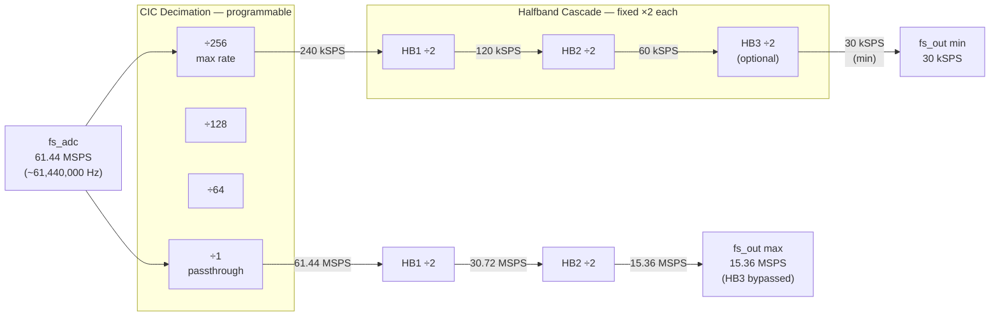

| Configuration | CIC Rate | HB1 | HB2 | HB3 | Total Dec. | Output Rate |
|:---|:---:|:---:|:---:|:---:|:---:|:---:|
| Max decimation | ×256 | ×2 | ×2 | ×2 | **×2048** | **30 kSPS** |
| Typical LEO FSK | ×64–128 | ×2 | ×2 | off | ×256–512 | **120–240 kSPS** |
| Wideband | ×4 | ×2 | ×2 | off | ×16 | **3.84 MSPS** |
| Bypass all | ×1 | ×2 | ×2 | off | ×4 | **15.36 MSPS** |

### 5.3 CORDIC NCO — Mathematical Principle

The **Coordinate Rotation Digital Computer (CORDIC)** algorithm computes complex rotation (frequency shift) through a sequence of elementary rotations by pre-computed angles, using only integer additions and shifts — perfectly suited to FPGA implementation.

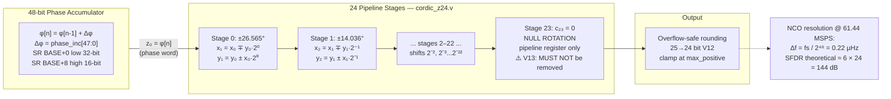

> **V13 Critical Note — Stage 23:** The 24th CORDIC stage (`c₂₃ = 0`, zero rotation) performs no mathematical computation. However, it provides a **mandatory pipeline register** that maintains the isochronous latency required by the UHD timing controller. Removing it (as in V12) reduces DDC+DUC latency by 2 cycles → `accum_timeout` on USB initialization.

### 5.4 CIC Filter — Mathematical Model

A Cascaded Integrator-Comb (CIC) filter of order N and decimation rate R has the transfer function:

$$H(z) = \left(\frac{1 - z^{-R}}{1 - z^{-1}}\right)^N$$

For N=4, R=256 (maximum rate):
- **Passband gain:** $R^N = 256^4 = 2^{32}$ → compensated by `cic_dec_shifter.v`
- **Droop at Nyquist/2:** sinc⁴(0.5) ≈ −3.9 dB → compensated by `cic_droop_comp.v` (V10)
- **Stopband attenuation:** >100 dB for aliases

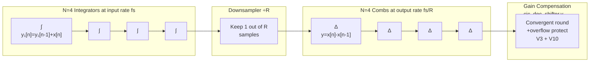

### 5.5 Noise Shaping — Sigma-Delta Output Stage

The final 33→16 bit reduction uses 2nd-order sigma-delta noise shaping, sculpting quantization noise out of the signal band:

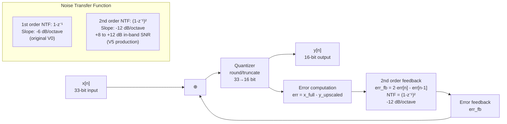

---

## 6. V13 DSP Architecture — TX Path (DUC)

The Digital Up Converter (DUC) is the mirror image of the DDC: it interpolates and frequency-shifts outgoing I/Q samples from the host before feeding them to the AD9361 DAC.

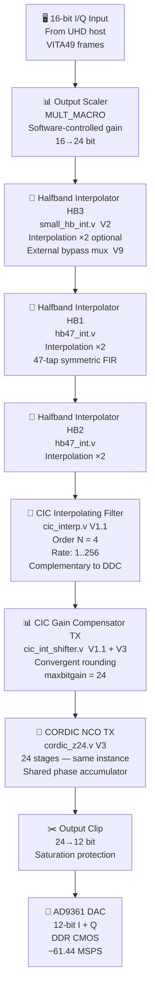

---

## 7. V13 Key Changes — Engineering Detail

V13 (commit `1573b8d`, tag `v13`, March 30 2026) fixes three issues introduced or exposed by V10–V12:

### 7.1 Fix 1 — CORDIC Stage 23 Restoration

**Problem (V12):** Stage 23 (`c₂₃ = 0`, no rotation) was removed as a "no-op optimization." This silently reduced the DDC+DUC pipeline latency by 2 cycles.

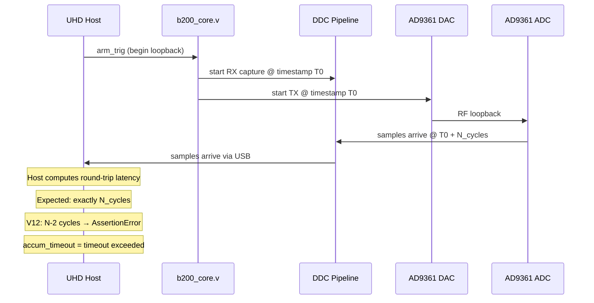

**V13 Fix:**
```verilog
// cordic_z24.v — Stage 23: mandatory pipeline register (c23 = 0)
// DO NOT REMOVE — provides 1 clock cycle of pipeline latency
// required by the UHD isochronous timing controller
cordic_stage #(.bitwidth(WIDTH+1), .zwidth(ZWIDTH), .shift(23))
  cordic_stage23 (
    .clk(clk), .reset(reset), .enable(enable),
    .xi(x23), .yi(y23), .zi(z23),
    .xo(x24), .yo(y24), .zo(z24),
    .constant(23'd0)   // c23 = 0 → zero rotation, pipeline only
  );
```

### 7.2 Fix 2 — CDC Synchronizer for `is10meg`

**Problem:** The PLL lock indicator (`is10meg`, indicating 10 MHz external reference lock) was driven from the PLL clock domain directly into the `sync_200M` domain without synchronization. This creates a **metastability** risk: a flip-flop can enter a metastable state for an indeterminate time when its setup/hold requirements are violated across clock boundaries.

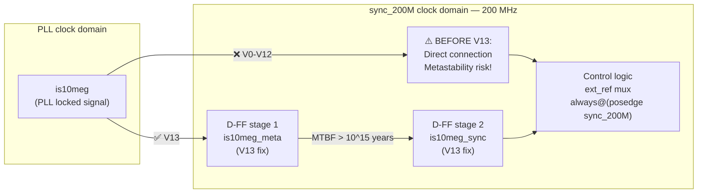

**V13 Fix in `libresdr_b210.v`:**
```verilog
// 2-stage synchronizer for is10meg (PLL lock → sync_200M domain)
reg is10meg_meta, is10meg_sync;
always @(posedge sync_200M) begin
    is10meg_meta <= is10meg;           // stage 1: capture, may be metastable
    is10meg_sync <= is10meg_meta;      // stage 2: resolved with high probability
end
// Use is10meg_sync everywhere in sync_200M domain (replaces is10meg)
```

### 7.3 Fix 3 — CIC Droop Compensator Pipeline Stage

**Problem (V10):** `cic_droop_comp.v` used a combinatorial path through two multiplications and a sum. The DSP48E1 `MREG` (internal pipeline register between multiplier and accumulator) could not be inferred, leaving a long combinatorial timing path.

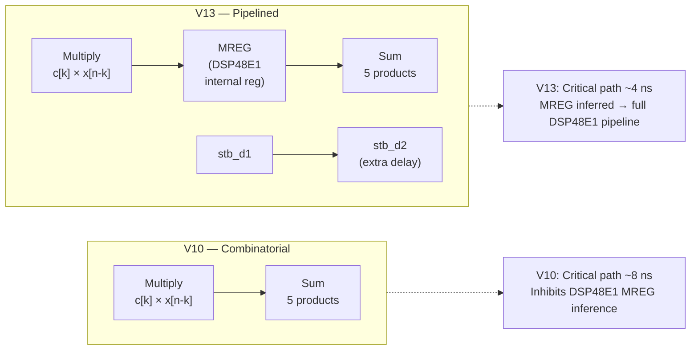

**V13 Changes:**
- Added `stb_d2` strobe pipeline stage to align output with MREG latency
- Bypass signal `d2_r` registered to match MREG pipeline depth
- DSP48E1 now infers 3-stage pipeline (A/B registers + MREG + P register)

---

## 8. Version History

### 8.1 Complete Version Table

| Ver. | Date | WNS | DSP | LUT% | Status | Key Change |
|:---|:---:|:---:|:---:|:---:|:---:|:---|
| V0 | Mar 2026 | — | ~100 | ~22 | ✅ Baseline | Original firmware |
| V1.0 | Mar 2026 | — | ~100 | ~22 | ❌ DEAD | GPIF FIFO sizes changed → USB broken |
| **V1.1** | Mar 2026 | +0.515 | 100 | 22.8 | ✅ | CIC ×256, DC offset IIR |
| **V2** | Mar 2026 | +0.165 | 112 | 24.1 | ✅ | IQ balance, HB3, NCO 48-bit |
| **V3** | Mar 2026 | +1.224 | 112 | 25.5 | ✅ | CORDIC 24-stage, convergent rounding, fix HB enable bits |
| **V3.1** | Mar 2026 | +0.369 | 112 | 25.5 | ✅ | Fix dither overflow at min-negative |
| **V4** | Mar 2026 | +0.228 | 112 | 25.6 | ✅ | IQ balance 24-bit full precision, HB overflow-safe |
| **V5** | Mar 2026 | +0.325 | 112 | ~26 | ✅ | Sigma-delta 2nd order NTF |
| V6 | Mar 2026 | +0.325 | 112 | ~26 | ⚠️ | Aggressive Vivado (RETIMING) — abandoned |
| V7 | Mar 2026 | +0.371 | 112 | ~35 | ❌ | HB full-precision — pipeline latency broken (−4 cycles) |
| V8 | Mar 2026 | +0.211 | 112 | 35.6 | ❌ | HB latency-safe — RETIMING still active → broken |
| V9 | Mar 2026 | +0.507 | 112 | ~26 | ❌ | HB3 bypass fix — Vivado Explore → broken |
| ⭐ **V9b** | Mar 2026 | +0.497 | 112 | ~26 | **✅ PROD** | Default Vivado strategies only |
| **V10** | Mar 2026 | +0.210 | 116 | 26.2 | ✅ | CIC droop comp, TPDF, DC dual-alpha, HB3 24-bit, CIC round-even |
| V11 | Mar 2026 | +0.180 | ~144 | 29.4 | ❌ | Adaptive ALE/NLMS — reverted (HW failure) |
| V12 | Mar 2026 | +1.244 | 116 | ~26 | ❌ | CORDIC stage 23 removed → accum_timeout |
| ⭐ **V13** | Mar 2026 | +0.266 | 116 | ~26 | **✅ PROD** | Restore CORDIC s23 + CDC is10meg + pipeline droop |
| **V14** | Mar 2026 | +0.494 | 116 | ~26 | ❌ | GPIF USB 2.0 boundary fix (512B) — packet_count assertion on CTRL |
| ⭐ **V15** | Apr 2026 | +0.879 | 116 | ~26 | **✅ PROD** | GPIF padding guard: DATA_RX only — fixes CTRL_RX desync |

### 8.2 V14 Engineering Detail

**Problem:** Intermittent `RuntimeError: fifo ctrl timed out getting a send buffer` during UHD init on USB 2.0 (480 Mbps) via usbipd-win/WSL2. Occurs ~1/7 startups.

**Root cause — FPGA side (`gpif2_slave_fifo32.v`):**
The GPIF-II state machine uses `transfer_size` to detect USB packet boundaries. The original code checks `transfer_size[7:0]==0` (256 words = 1024 bytes), which only matches USB 3.0 maxpacket size. On USB 2.0, maxpacket is 512 bytes (128 words), causing the FSM to miss packet boundaries and stall.

**Fix:** `transfer_size[7:0]==0` → `transfer_size[6:0]==0` in both `STATE_THINK` (line ~228) and `STATE_WRITE` (line ~342). This detects 128-word (512B) boundaries for USB 2.0 while remaining compatible with USB 3.0 (128 words divides 256 words).

**Root cause — Host side (`b200_radio_ctrl_core.cpp`):**
`send_pkt()` calls `get_send_buff(0.0)` — zero timeout. USB-over-IP via usbipd-win adds 1-5 ms latency per transfer, making zero timeout intolerant of the virtual USB-over-IP stack.

**Fix (in f4tnk/uhd fork):** `get_send_buff(0.0)` → `get_send_buff(0.5)` (500 ms timeout). Commit `734fa0e6a` on `master-f4tnk`.

### 8.3 V15 Engineering Detail

**Problem:** V14 FPGA causes `AssertionError: packet_info.packet_count == (seq_to_ack & 0xfff)` during UHD radio ctrl initialization. Occurs on every startup attempt (3/3 retries fail).

**Root cause (`gpif2_slave_fifo32.v`):**
The V14 change (`transfer_size[6:0]==0` for 512B USB 2.0 boundary detection) affected **all FIFO endpoints** equally. The `transfer_size` counter is shared across DATA_RX, DATA_TX, CTRL_RX, and CTRL_TX — it is NOT reset when the state machine switches endpoints (STATE_IDLE → STATE_WAIT → STATE_THINK). When a DATA_RX burst ends without `pktend` (e.g., FX3 full → STATE_WRITE_FLUSH without counter reset), the stale counter value persists. When CTRL_RX then sends a small response packet (~4 words), `transfer_size` can cross the 128-word boundary (`[6:0]==0`), triggering a false padding cycle. This extra padding byte desynchronizes the USB packet framing, causing UHD's radio ctrl to see a mismatched sequence number.

**Fix:** Add `(fifoadr == ADDR_DATA_RX)` guard to both padding conditions:
- `STATE_THINK` (line ~230): `... && (transfer_size[6:0] == 0) && (fifoadr == ADDR_DATA_RX)`
- `STATE_WRITE` (line ~349): `... && (transfer_size[6:0] == 0) && (fifoadr == ADDR_DATA_RX)`

This ensures 512B boundary padding only triggers for the data streaming endpoint, where long bursts genuinely need it. CTRL_RX packets are always small (<32 words) and must never be padded — their termination is handled solely by `pktend`.

**Build results:** WNS +0.879 ns (best of all versions), 0 failing endpoints, 4,519,920 bytes.

### 8.4 DSP Improvement Accumulation

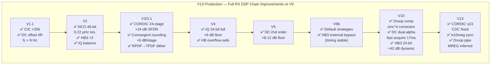

---

## 9. Absolute Design Rules

These rules are derived from hardware failures across 15 firmware versions. **Violating any rule guarantees a non-functional firmware.**

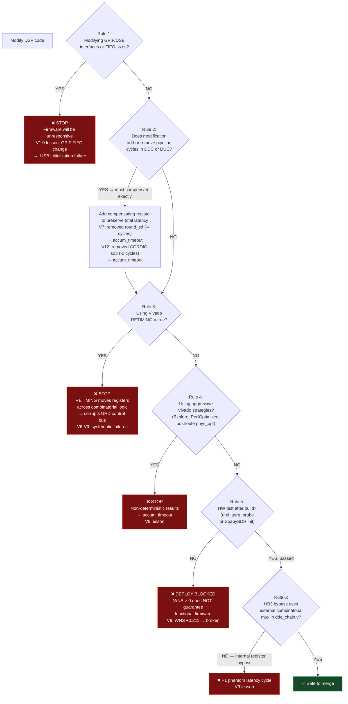

### Rule Summary Table

| # | Rule | Root Cause Version | Effect of Violation |
|:---:|:---|:---:|:---|
| 1 | Never modify GPIF/USB interfaces or FIFO sizes | V1.0 | USB initialization failure, unresponsive firmware |
| 2 | Preserve DDC/DUC pipeline latency to the exact cycle | V7, V12 | `accum_timeout` on UHD USB init loopback |
| 3 | Never use Vivado RETIMING | V6–V9 | Corruption of UHD control bus (non-deterministic) |
| 4 | Use only Vivado default strategies | V9 | Non-deterministic routing → `accum_timeout` |
| 5 | Test every build on hardware before declaring success | V8 | WNS positive ≠ functional firmware |
| 6 | HB3 bypass must be external combinatorial mux | V9 | +1 phantom cycle breaks isochronous timing |
| 7 | Never remove a CORDIC stage even if `cₙ = 0` | V12 | −1 DDC cycle + −1 DUC cycle → `accum_timeout` |
| 8 | GPIF packet boundary check must match USB speed (512B for USB 2.0) | V14 | FSM stall → fifo ctrl timeout on USB 2.0 hosts |
| 9 | GPIF padding must be guarded by endpoint address (DATA_RX only) | V14→V15 | Unguarded padding contaminates CTRL_RX → packet_count assertion |

---

## 10. RTL Audit Results — V13

A systematic audit of ~80 Verilog files was performed on V13 (March 30, 2026).

### 10.1 Audit Scope

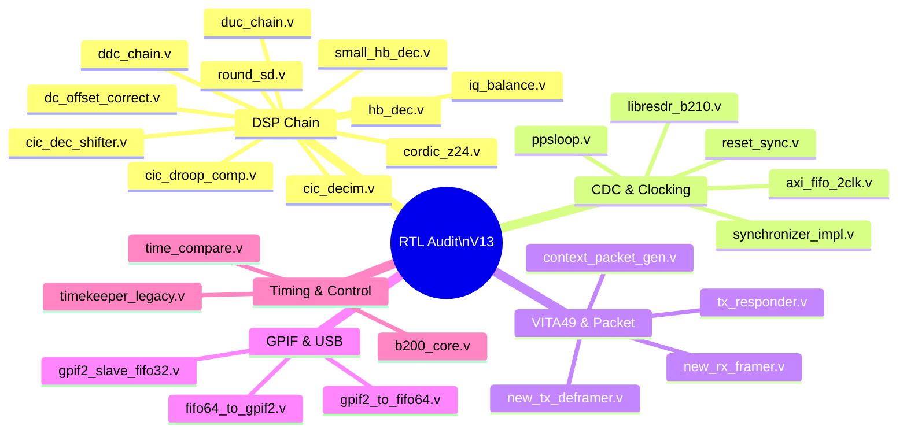

### 10.2 Findings

| Severity | Item | File | Status |
|:---|:---|:---|:---:|
| 🔴 **CRITICAL** | CORDIC stage 23 removed | `cordic_z24.v` | ✅ Fixed V13 |
| 🔴 **CRITICAL** | CDC missing on `is10meg` | `libresdr_b210.v` | ✅ Fixed V13 |
| 🔴 **CRITICAL** | Droop comp combinatorial path | `cic_droop_comp.v` | ✅ Fixed V13 |
| 🟡 **MEDIUM** | `ST_WAIT` FSM state not implemented | `new_tx_control.v` | ℹ️ Original Ettus code, UHD never sets this bit |
| 🟢 **LOW** | Sample loss at burst-end in `SECOND` state | `new_rx_framer.v` | ℹ️ <0.01% probability, `eob` flag prevents it |
| 🟢 **LOW** | 33-entry combinatorial MUX | `cic_dec_shifter.v` | ℹ️ WNS +0.266 ns, no action needed |
| 💡 **INFO** | Dead code under `NEW_HB_DECIM=1` | `hb_dec.v`, `add2.v` | ℹ️ Never elaborated, no bitstream impact |

**Overall assessment:** The design is mature and well-structured. All critical CDC paths are properly synchronized:
- `synchronizer_impl.v` uses `ASYNC_REG` attribute for guaranteed MTBF
- `reset_sync.v` implements 10-stage synchronizer chain
- `axi_fifo_2clk` uses dual-port BRAM FIFOs with gray-coded pointers
- V13 adds the missing `is10meg` CDC 2-stage DFF

---

## 11. FPGA Resource Utilization

### 11.1 V13 Post-Implementation Results

| Resource | Used | Available | Utilization | Trend vs V9b |
|:---|:---:|:---:|:---:|:---:|
| Slice LUTs | ~35,200 | 134,600 | **~26.1 %** | +0.1% |
| Slice Registers | ~39,000 | 269,200 | **~14.5 %** | +0.3% |
| Block RAM (RAMB36) | 115.5 | 365 | **31.6 %** | = |
| DSP48E1 | **116** | 740 | **15.7 %** | +4 (V10 droop) |
| WNS (setup) | — | — | **+0.266 ns** ✅ | −0.231 ns |
| WHS (hold) | — | — | **+0.050 ns** ✅ | — |
| WPWS | — | — | **+1.646 ns** ✅ | — |
| Failing endpoints | 0 | — | **0 setup + 0 hold** | — |
| Binary size | 4,367,092 bytes | — | — | −27,860 vs V9b |
| SHA256 | `b6720ee9...` | — | — | — |

### 11.2 DSP48E1 Allocation by Function

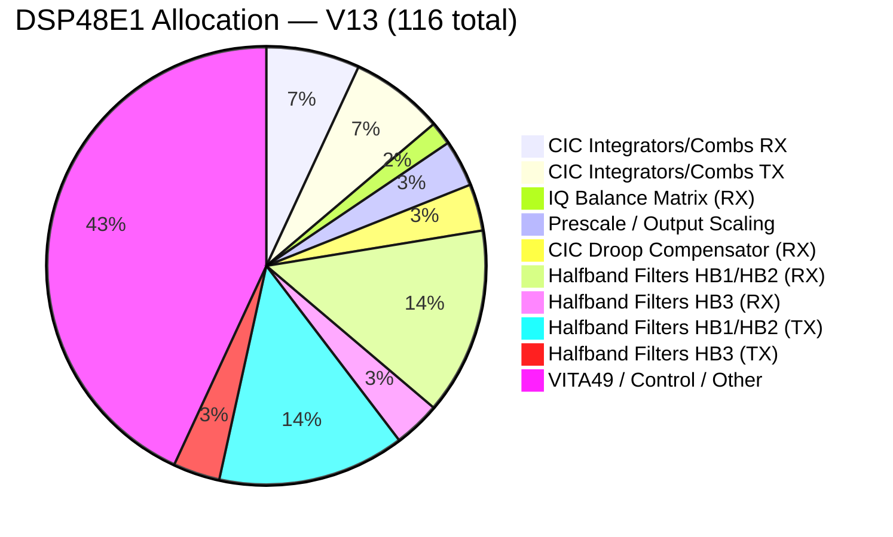

### 11.3 Available Headroom

The XC7A200T has significant remaining capacity for future optimizations:

| Resource | Used | **Free** | Notes |
|:---|:---:|:---:|:---|
| Slice LUTs | 26.1% | **73.9%** | ~99,000 LUTs available |
| DSP48E1 | 15.7% | **84.3%** | ~624 DSPs available |
| Block RAM | 31.6% | **68.4%** | ~249 BRAMs available |

---

## 12. Build & Deployment

### 12.1 Toolchain Requirements

| Tool | Version | Purpose |
|:---|:---|:---|
| Vivado | **2025.2** | Synthesis + implementation + bitstream generation |
| OS | Ubuntu 24.04 LTS | Tested environment |
| RAM | ≥ 16 GB | Artix-7 200T implementation requires ~12 GB peak |
| Disk | ≥ 10 GB | Project + build outputs |

### 12.2 Build Flow

```mermaid
flowchart LR
    SRC["📁 Source Files\n31 Verilog modules\nsrc/libresdr_b210.srcs/"]

    SYNTH["🔨 Synthesis\nVivado Synthesis Defaults\n~8 min / 8 threads\nRTL → netlist"]
    SRC --> SYNTH

    IMPL["🧩 Implementation\nVivado Implementation Defaults\n~12 min\nPlace & Route"]
    SYNTH --> IMPL

    CHECK["✅ Timing Check\nWNS > 0 required\nWHS > 0 required\n0 failing endpoints"]
    IMPL --> CHECK

    BIN["💾 Bitstream\ngen_bin.tcl\nBit → BIN compression\n~4.4 MB output"]
    CHECK -->|"Timing MET"| BIN
    CHECK -->|"Timing FAILED"| FAIL["❌ Do not deploy\nCheck WNS, adjust constraints"]

    HW["🔌 Hardware Test\nuhd_usrp_probe\nRegister loopback PASS\nSoapySDR init OK"]
    BIN --> HW
    HW -->|"PASS"| DEPLOY["✅ Deploy to production\nDocker copy + restart"]
    HW -->|"FAIL"| DEBUG["🔍 Debug\nCheck latency rules\nNever use RETIMING"]
```

### 12.3 Critical Vivado Settings

```tcl
# build.tcl — V13 production settings
# ⚠️ These are the ONLY safe strategies. Do NOT change.
set_property strategy {Vivado Synthesis Defaults}     [get_runs synth_1]
set_property strategy {Vivado Implementation Defaults} [get_runs impl_1]

# ❌ FORBIDDEN — will corrupt UHD control bus
# set_property STEPS.SYNTH_DESIGN.ARGS.RETIMING true [get_runs synth_1]
# set_property strategy {Flow_PerfOptimized_high} [get_runs synth_1]
```

### 12.4 Deployment to SatNOGS Docker Station

```bash
# 1. Copy firmware binary to container
docker cp libresdr_b220_v13.bin \
    station-3762-satnogs_client-1:/usr/share/uhd/images/usrp_b220_fpga.bin

# 2. Restart container
docker restart station-3762-satnogs_client-1

# 3. Verify UHD initialization (expect ~70s full init)
docker logs -f station-3762-satnogs_client-1 2>&1 | \
    grep -E "Register loopback|FPGA|firmware|accum"

# Expected success output:
# [B200] Loading FPGA image: .../usrp_b220_fpga.bin...
# [B200] Register loopback test passed
```

### 12.5 Post-Deployment Validation Checklist

```mermaid
flowchart TD
    S1["🔌 USB device detected\nID 2500:0020\nlsusb"]
    S2["💾 FX3 firmware loaded\n'Loading firmware image'\n~2s"]
    S3["🔷 FPGA bitstream loaded\n'Loading FPGA image'\n~5s"]
    S4["🔄 Register loopback\n'loopback test passed'\n~10s"]
    S5["📡 AD9361 initialized\n'B200: Performing calibration'\n~60s"]
    S6["✅ UHD ready\nuhd_usrp_probe returns\nFull device tree"]
    FAIL_USB["❌ Check USB cable\nCheck driver"]
    FAIL_FX3["❌ FX3 firmware missing\nCheck uhd_images"]
    FAIL_BIT["❌ Bitstream corrupt\nRe-copy firmware file"]
    FAIL_REG["❌ accum_timeout\nLatency violation in DSP\nRevert to V9b"]

    S1 -->|"✅"| S2
    S1 -->|"❌"| FAIL_USB
    S2 -->|"✅"| S3
    S2 -->|"❌"| FAIL_FX3
    S3 -->|"✅"| S4
    S3 -->|"❌"| FAIL_BIT
    S4 -->|"✅"| S5
    S4 -->|"❌"| FAIL_REG
    S5 -->|"✅"| S6

    classDef fail fill:#7b1010,stroke:#e74c3c,color:#fff
    classDef ok fill:#1a472a,stroke:#2ecc71,color:#fff
    class FAIL_USB,FAIL_FX3,FAIL_BIT,FAIL_REG fail
    class S6 ok
```

---

## Appendix A — Key Verilog Files Reference

| File | Module | Version | Description |
|:---|:---|:---:|:---|
| `ddc_chain.v` | `ddc_chain` | V13 | Top-level RX DDC chain, all DSP stages wired together |
| `duc_chain.v` | `duc_chain` | V13 | Top-level TX DUC chain |
| `cordic_z24.v` | `cordic_z24` | V12+V13 | 24-stage CORDIC NCO, 48-bit phase accumulator |
| `cic_decim.v` | `cic_decim` | V1.1 | CIC decimation filter, N=4, rate 1–256 |
| `cic_dec_shifter.v` | `cic_dec_shifter` | V3+V10 | CIC gain compensation + convergent rounding |
| `cic_droop_comp.v` | `cic_droop_comp` | V10+V13 | Sinc⁴ inverse FIR 5-tap, pipelined DSP48E1 |
| `dc_offset_correct.v` | `dc_offset_correct` | V1.1+V12 | IIR HP filter, dual-alpha, 44-bit accumulator |
| `iq_balance.v` | `iq_balance` | V2+V4 | 2×2 compensation matrix, 24×18 full precision |
| `hb_dec.v` | `hbdec1`, `hbdec2` | V4+V10 | 47-tap halfband decimators HB1/HB2 |
| `small_hb_dec.v` | `small_hb_dec` | V2+V10 | HB3 halfband, full 24-bit datapath |
| `round_sd.v` | `round_sd` | V5 | Sigma-delta noise shaping, order 1 or 2 |
| `libresdr_b210.v` | `libresdr_b210` | V13 | FPGA top-level, CDC is10meg fix |
| `b200_core.v` | `b200_core` | V0 | Control plane, DO NOT MODIFY |
| `gpif2_slave_fifo32.v` | `gpif2_slave_fifo32` | V15 | GPIF-II USB interface — V14: 512B boundary + V15: DATA_RX-only padding guard |

---

## Appendix B — Glossary

| Term | Definition |
|:---|:---|
| **ADC** | Analog-to-Digital Converter — transforms continuous voltage to digital samples |
| **CORDIC** | Coordinate Rotation Digital Computer — iterative rotation algorithm using shifts/adds |
| **CIC** | Cascaded Integrator-Comb — efficient recursive filter for large decimation/interpolation rates |
| **CDC** | Clock Domain Crossing — signal path between two independent clock domains |
| **DDC** | Digital Down Converter — decimation + frequency shifting of ADC samples |
| **DSP48E1** | Xilinx 7-Series hard multiplier-accumulator primitive (18×25-bit, 48-bit acc) |
| **DUC** | Digital Up Converter — interpolation + frequency shifting for DAC samples |
| **FPGA** | Field-Programmable Gate Array — reconfigurable logic semiconductor device |
| **IQ** | In-phase/Quadrature — complex baseband representation of a bandpass signal |
| **LUT** | Look-Up Table — basic configurable logic cell in an FPGA |
| **NCO** | Numerically-Controlled Oscillator — digital sinusoid generator using phase accumulation |
| **NTF** | Noise Transfer Function — frequency shaping applied to quantization error |
| **RPDF/TPDF** | Rectangular/Triangular Probability Density Function — statistical models for dither noise |
| **SFDR** | Spurious-Free Dynamic Range — ratio of fundamental to worst harmonic/spur |
| **SNR** | Signal-to-Noise Ratio — ratio of signal power to noise power |
| **VHD/Verilog** | Hardware Description Languages — used to describe FPGA logic |
| **VITA49** | Open standard for software-defined radio data transport (packetization format) |
| **WNS** | Worst Negative Slack — timing margin; must be ≥ 0 for a valid build |
| **WHS** | Worst Hold Slack — hold timing margin; must be ≥ 0 |
